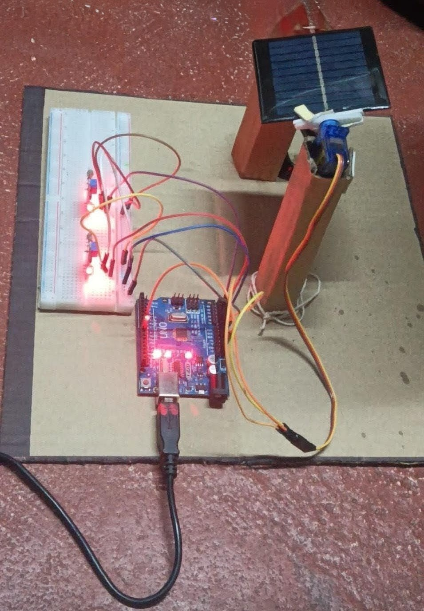
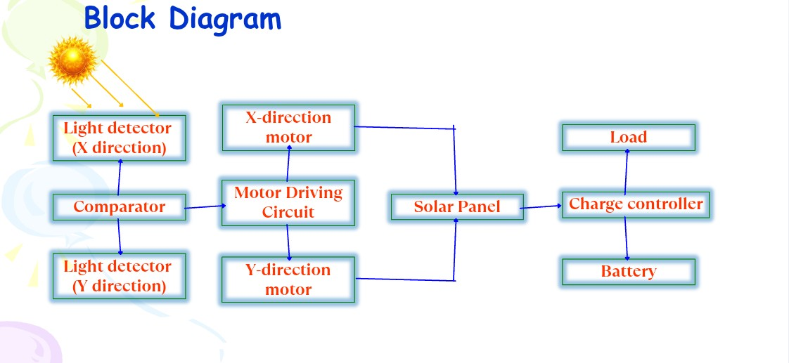
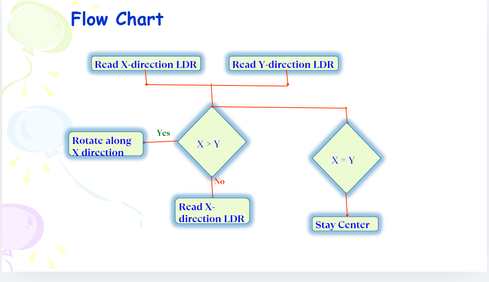

# Single-Axis Automatic Solar Tracking System

An Arduino Uno-based single-axis solar tracking system designed to dynamically orient a solar panel toward maximum light intensity using LDR sensors, optimizing overall energy collection efficiency.

---

## 📌 Project Overview

Solar panels generate maximum power when oriented directly toward sunlight. This project reads differential light intensity using two Light Dependent Resistor (LDR) sensor modules connected to an Arduino Uno. Based on the light difference between the sensors, an SG90 servo motor rotates the mini solar panel toward the light source.

## 🎯 Objectives

- Design a system that automatically tracks sunlight
- Measure light intensity using two LDR sensors
- Process sensor data using an Arduino Uno
- Rotate a solar panel using a servo motor toward maximum light
- Improve the efficiency of solar energy collection

---

## 🧩 Block Diagram

---

## 🛠️ Components & Bill of Materials (BOM)

| Component | Quantity | Description | Estimated Cost (INR) |
| :--- | :---: | :--- | :---: |
| **Arduino Uno** | 1 | ATmega328P Microcontroller Board | ₹1,000.00 |
| **LDR Sensor Modules** | 2 | Light intensity detection modules | ₹40.00 |
| **SG90 Servo Motor** | 1 | 0° - 180° micro servo motor | ₹150.00 |
| **Mini Solar Panel** | 1 | PV cell target load mounted on motor | ₹200.00 |
| **Breadboard / Resistors / Wires** | 1 Set | Circuit interconnects (10 kΩ resistors) | ₹50.00 |
| **Total** | | | **₹1,440.00** |

---

## 🔌 Pin Mapping Table

| Hardware Component | Component Pin | Arduino Uno Pin |
| :--- | :--- | :--- |
| **Left LDR Sensor** | Analog Output (AO) | `A0` |
| **Right LDR Sensor** | Analog Output (AO) | `A1` |
| **SG90 Servo Motor** | Control Signal (Yellow/Orange) | `Digital Pin 9 (PWM)` |
| **Power Rails** | VCC / GND | `5V` / `GND` |

---

## ⚡ How It Works

1. **Light Intensity Reading:** Analog pins `A0` and `A1` sample voltage outputs proportional to light hitting each LDR sensor.
2. **Differential Comparison:** The program calculates `difference = leftValue - rightValue`.
3. **Servo Adjustment:**
   - If `difference > 50`: Light is stronger on the left, so the servo position increments (`pos++`).
   - If `difference < -50`: Light is stronger on the right, so the servo position decrements (`pos--`).
   - If `|difference| <= 50`: The panel stays at its current angle.
4. **Safety Constraint:** Motor position values are constrained between 0° and 180° to stay within physical hardware bounds.

---

## 🔄 Program Flowchart

---

## 💻 Source Code

The Arduino sketch (`src/solar_tracker.ino`) reads both LDR sensors, computes the light-intensity difference, and steps the servo toward the brighter side each loop iteration, with a 50 ms delay for smooth motion and position values constrained to the 0°–180° servo range.

---

## ✅ Outcome / Results

- Panel automatically tracks sunlight
- Compares light intensity accurately
- Servo adjusts position effectively
- Low-cost implementation
- Improves energy efficiency

## 🔭 Conclusion & Future Scope

Successfully implemented a cost-effective, single-axis automatic solar tracking system that improves solar panel efficiency. The design can be extended to dual-axis tracking and is simple enough to scale toward commercial-size production.

---

## 📎 Full Presentation

The complete project presentation (objectives, hardware/software breakdown, budget, and team contributions) is available at [`assets/solar_panel_project.pdf`](assets/solar_panel_project.pdf).

---

## 🚀 Getting Started

1. Wire the components according to the [Pin Mapping Table](#-pin-mapping-table) and [Block Diagram](#-block-diagram).
2. Open `solar_tracker.ino` in the Arduino IDE.
3. Select **Arduino Uno** as the board and the correct COM port.
4. Upload the sketch.
5. Open the Serial Monitor at `9600` baud to observe live LDR readings and servo position.
